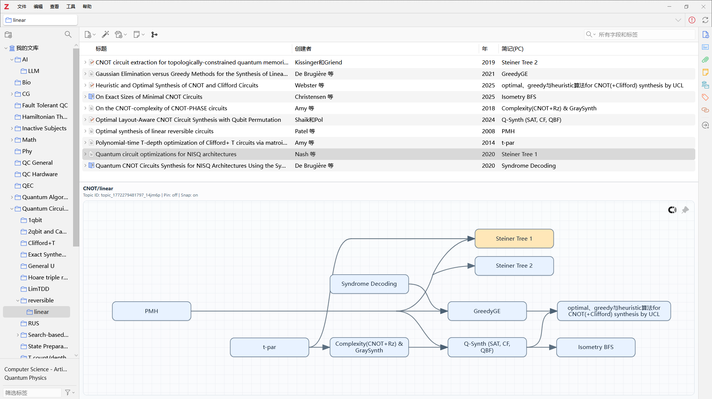

<div align="center">
  
</div>

---
<p align="center">A Zotero 7 plugin for organizing separate papers into connected context</p>

`Paper Connections` is a plugin for Zotero 7 that allows you to:

+ Organize **separate papers** into related topics,
+ **Visualize** and interact with the topic nicely, and
+ **Export** the topic as reusable images (SVG).



## For Users

### Install

Binaries (`.xpi` files) are available at [Github Release Page](https://github.com/IcyChlorine/paper-connections/releases).

To install: open Zotero, open `Options` Menu->`Plugins`, then 1) drag and drop the `.xpi` file to the window or 2) choose "⚙->Install Plugin From File" to install the plugin.

### How to use?

**Create a topic:** 

1. Select a paper, right click on the relation graph workspace -> `new topic`,
2. Pin the fresh topic, drag and drop other papers into the workspace,
3. Drag from anchors of a paper node to create connection edges,
4. `Alt` + right click drag to cut (remove) edges.


**Organize your topic:**

1. Click a paper node to select it; Drag a node to move it.
2. Right click a paper node or `F2` to rename the node.
3. `Shift`+right click drag to bundle multiple edges.


**Reverse selection:**

+ Selection of a node in the graph would be synchronized to the list.
+ Double-click a node would open the pdf file attached to the paper, just like double-clicking the item in the list.


**Export:** Right click in the graph workspace, choose "export as SVG".

Export image demo:


Turn on/off the graph workspace: press '`' key.

Toggle graph workspace pane fullspace: Ctrl+'`'.

## For Developer/Contributors

### Documentation

- [Current feature baseline](doc/current-features.md)
- [Graph render / refresh API](doc/graph-render-refresh.md)
- [Storage model and CRUD API](doc/storage-crud.md)

### Agentic/Vibe Coding

This project maintains a hierarchy of durability files that allows continuous development by coding agent such as `codex`. Any coding agent can access the project hierarchy, documentation, dev history, and other information necessary for developing or adding new features to the project.

For commonly requested features I may realize them in the future versions; but for very personal features, I recommend forking the project on your own and realize it with your own agent, as this project is mainly intended for my personal use :-)

### Build

The following script build a `.xpi` file at `build\` directory that is ready to install from the source codes:

```bash
.\make-zips.sh
```

Or for powershell users:

```powershell
.\make-zips.ps1
```

## Development

For day-to-day development, the following script automatically build the XPI, copy it straight into the target Zotero profile, and restart Zotero in one step.

```powershell
.\tools\build-install-restart.ps1 -ProfileName <profile_name>
```

`build-install-restart.ps1` asks for confirmation first, runs `.\make-zips.ps1`, closes any running Zotero instance, removes any leftover source-proxy file for this plugin, copies `build/paper-connections.xpi` into the selected profile's `extensions` directory as `paper-connections@example.com.xpi`, clears the two `extensions.lastApp*` cache markers in that profile's `prefs.js`, and relaunches Zotero with `-p <profile_name>` and `-purgecaches` by default.

`restart-zotero-dev.ps1` remains available when you only want to relaunch Zotero without rebuilding or reinstalling the plugin:

```powershell
.\tools\restart-zotero-dev.ps1 -ProfileName <profile_name>
```
